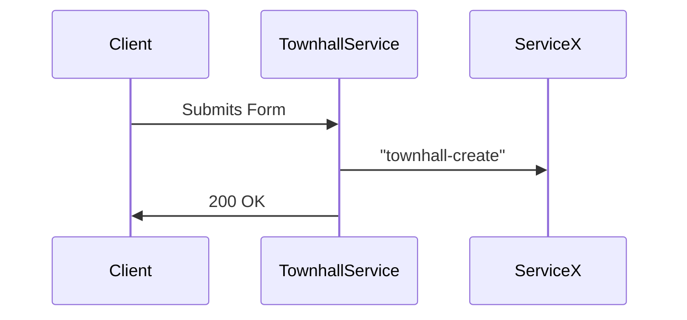
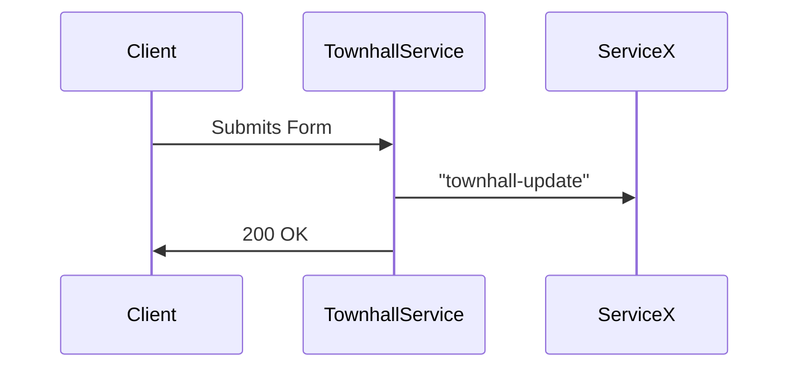
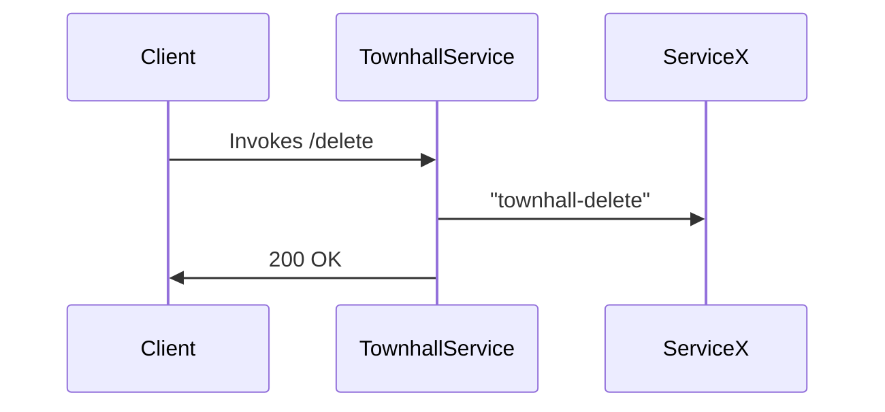
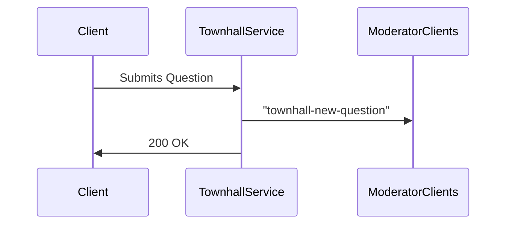
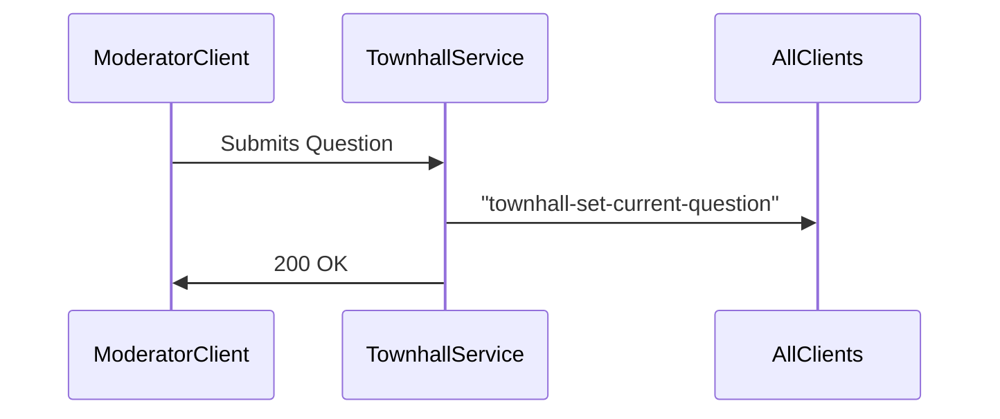

# 01 - Townhall Service

#### Description

Central Townhall service that acts as a hub for everything townhall related, may be composed of other microservices.
For now, this will include the ML/AI too. Later we will refactor this out.

#### Motivation

Self-explanatory

#### TODO

1. save failed emits to a collection in the db
2. logging
3. then create a setinterval that checks that collection every 30 minutes?

#### Stories

##### Cycle 1

-   A `Moderator or Admin` should be able to create a townhall
-   A `Moderator or Admin` should be able to update a townhall
-   A `Moderator or Admin` should be able to delete a townhall
-   A `Moderator or Admin` should be able to upload an invitation list

##### Cycle 2

-   A `Moderator or Admin` should be able to choose if a townhall is invite only or not
-   A `Moderator or Admin` should be able to choose if a townhall has a "chat" feature

#### Tentative Models

##### Townhall

```json
{
  _id: string,
  meta: {
    createdAt: date,
    createdBy: {
      name: {
        first: string,
        last: string
      },
      _id: string
    }
    updatedAt: date,
    updatedBy: {
      name: {
        first: string,
        last: string
      },
      _id: string
    }
  }
  form: {
    datetime: date, // UTC
    speaker: string, // may be an object or reference in the future, TODO: how will we set a region for this?
    description: string,
    moderator: string, // may be an object or reference in the future
    url: string, // the relevant youtube url
  },
  settings: {
    chat: boolean, // in the future this may be an object when our chat has multiple features besides visible or not
  },
  questions: string[], // will be db id's of questions
}
```

##### Questions

Index on townhall.\_id

```json
{
  _id: string,
  meta: {
    createdAt: string,
    createdBy: {
      name: {
        first: string,
        last: string
      },
      _id: string
    }
  },
  classifications: {
    isToxic: boolean, // previously toxicity
    toxicityReasons: string[], // TODO ARRAY OF WHAT?
    sentenceCode: [],
    relevantWeight: number,
    isCenter: boolean,
    clusterNumber: number,
  }
  townhall: {
    _id: string,
    used: boolean,
    timestamp: number // with respect to the video, not the current date
  },
  form: {
    question: string
  }
}
```

#### Server->Server Publications

1. "townhall-create" -> full db model
2. "townhall-update" -> full db model
3. "townhall-delete" -> `{ _id: string }`

#### Server->Client

1. "townhall-new-question" -> only sent to mods with the full question doc
2. "townhall-set-current-question" -> full question doc

#### Subscriptions

N/A

#### Endpoints

1. POST /create
    - [mod, admin]
    - create a townhall



2. POST /:\_id/update
    - [mod, admin]
    - update the stored form of the townhall



3. DELETE /:\_id
    - [mod, admin]
    - Don't actually delete, just move to a "deleted collection" so we can recover easily



4. GET /
    - [any user]
    - list of townhalls
5. GET /:\_id
    - [any user]
    - gets specific townhall information
6. POST /:\_id/create-question
    - [any user]



7. POST /:\_id/set-current-question
    - [moderator, admin]


